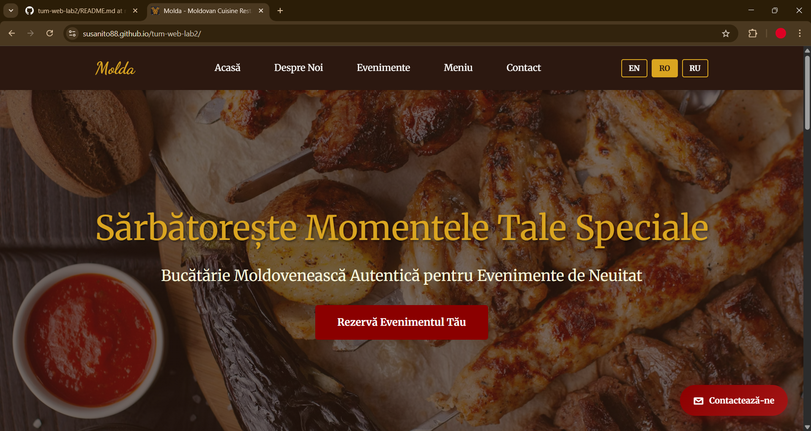
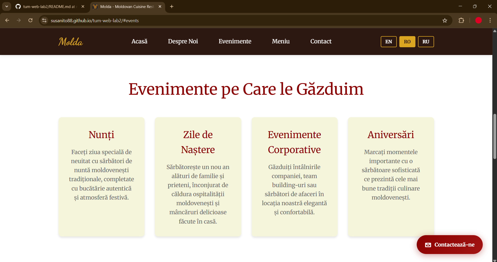

# Molda - Moldovan Cuisine Restaurant Landing Page

A professional landing page for a Moldovan restaurant specializing in traditional cuisine and special events hosting.

## 📋 Description

This landing page showcases "Molda", a Moldovan restaurant that hosts special events such as weddings, birthdays, corporate events, and anniversaries. The website features traditional Moldovan dishes and provides an easy way for clients to book their events.

## ✨ Features

- **Multi-language Support**: English, Romanian, and Russian language options
- **Responsive Design**: Fully responsive layout that works on all devices
- **Smooth Scroll Animations**: Engaging animations as you scroll through sections
- **Interactive Elements**:
  - Fixed navigation bar with smooth scroll to sections
  - Floating contact button that scrolls to the booking form
  - Language selector
- **5 Main Sections**:
  1. **Hero Section**: Eye-catching introduction with call-to-action
  2. **About**: Information about the restaurant and services
  3. **Events**: Types of events hosted (weddings, birthdays, corporate, anniversaries)
  4. **Menu**: Traditional Moldovan dishes (Mămăligă, Sarmale, Plăcintă, Cozonac)
  5. **Contact**: Booking form and contact information

## 🛠️ Technologies Used

- **HTML5**: Semantic markup
- **CSS3**: Custom styling with:
  - CSS Variables for consistent theming
  - Flexbox and Grid layouts
  - CSS animations and transitions
  - Media queries for responsiveness
- **Vanilla JavaScript**: For interactive features (language switching, scroll animations, floating button)
- **Google Fonts**: Merriweather (body) and Dancing Script (logo)

## 🎨 Design Features

- **Color Scheme**:
  - Primary: Dark Red (#8b0000)
  - Secondary: Goldenrod (#daa520)
  - Accent: Dark Brown (#2c1810)
  - Light: Beige (#f5f5dc)
- **Typography**: Elegant serif font for readability and cursive for branding
- **Background Image**: Beautiful food photography in hero section with parallax effect
- **Animations**: Smooth fade-in and slide animations on scroll

## 🚀 Live Demo

**[View Live Website](https://susanito88.github.io/tum-web-lab2/)**

## 📸 Screenshots

### Desktop View - Hero Section



### Desktop View - Events Section



## 📦 Project Structure

```
tum-web-lab2/
├── index.html          # Main HTML file
├── style.css           # Custom CSS styles
├── reset.css           # CSS reset for browser consistency
├── translations.js     # Multi-language translations
├── favicon.png         # Site favicon
└── README.md          # Project documentation
```

## 🎯 Project Requirements Met

- ✅ Navigation to sections with smooth scroll
- ✅ Clear call-to-action buttons
- ✅ 5 sections (exceeds minimum of 4)
- ✅ Pleasant, professional design
- ✅ Vanilla CSS and HTML (no frameworks)
- ✅ Multiple meaningful git commits
- ✅ Deployed on GitHub Pages
- ✅ Uses `index.html` and `reset.css`
- ✅ Real business client (Moldovan restaurant)

## 👨‍💻 Development

To run locally:

1. Clone the repository:

   ```bash
   git clone https://github.com/susanito88/tum-web-lab2.git
   ```

2. Open `index.html` in your browser or use a local server:

   ```bash
   # Using Python
   python -m http.server 8000

   # Using Node.js
   npx serve
   ```

3. Visit `http://localhost:8000` in your browser

## 📝 License

This project is open source and available for educational purposes.

## 👤 Author

Created for Web Development Lab 2 - TUM

---

**Note**: This is a student project created for educational purposes as part of the Web Development course at Technical University of Moldova.
