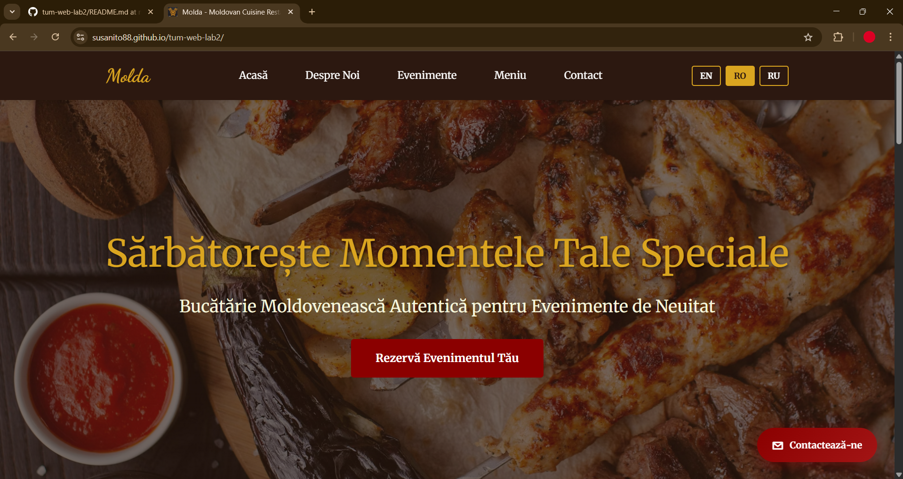
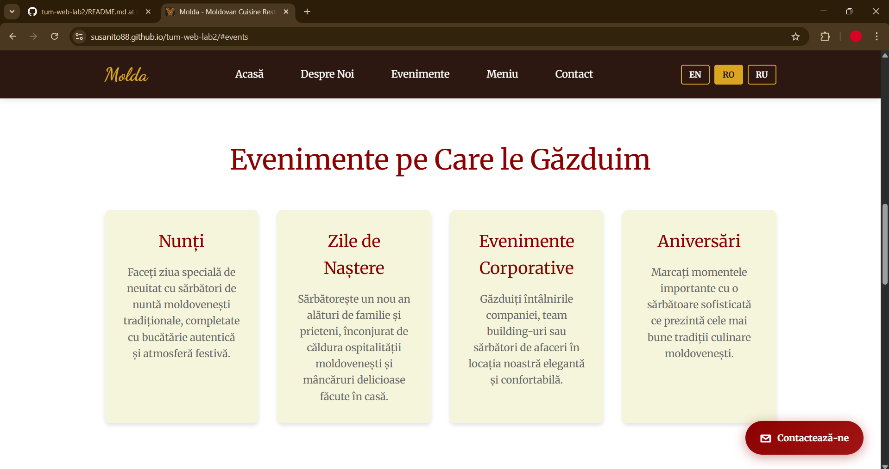

# Molda - Moldovan Cuisine Restaurant

A restaurant landing page built with **Astro** SSG + **Decap CMS** for Git-based content management. Deployed on Netlify.

## 🏗️ Stack (Lab 4)

| Layer  | Choice                            | Why                                                |
| ------ | --------------------------------- | -------------------------------------------------- |
| SSG    | [Astro](https://astro.build)      | Near-zero JS, native Tailwind, easy HTML migration |
| CMS    | [Decap CMS](https://decapcms.org) | Git-based, every edit = a commit, free on Netlify  |
| CSS    | Tailwind CSS + custom animations  | Carried over from Lab 3                            |
| Deploy | Netlify                           | Free tier, built-in Decap CMS auth                 |

## 📁 Project Structure

```
src/
  content/
    settings/site.yaml   ← Hero, About, Contact, section titles
    events/*.yaml        ← Wedding, Birthday, Corporate, Anniversary
    menu/*.yaml          ← Mămăligă, Sarmale, Plăcintă, Mici, Zeamă, Cozonac
  layouts/Layout.astro
  components/            ← Nav, Hero, About, Events, Menu, Contact, Footer
  pages/index.astro
public/
  admin/
    config.yml           ← Decap CMS backend & collections
    index.html           ← CMS entry point (/admin)
  css/, js/, assets/
netlify.toml
```

## 🚀 Local Development

```bash
npm install
npm run dev        # → http://localhost:4321
npm run build      # Build to dist/
npm run preview    # Preview production build
```

## ✏️ CMS Setup (after deploying to Netlify)

1. Push this repo to GitHub
2. Connect the repo to Netlify (Build command: `npm run build`, Publish dir: `dist`)
3. In Netlify → **Identity** → Enable Identity
4. In Netlify → **Identity** → **Services** → Enable **Git Gateway**
5. Visit `https://molda.me/admin` to access the CMS
6. Invite yourself via the Identity panel

Every save in the CMS creates a commit to `main`, which triggers a new deploy.

## 🌍 Languages

The site supports **English**, **Romanian**, and **Russian** via `public/js/translations.js`. The CMS manages the English content; the JS overrides text per language on the client.

## ✨ Features

- Multi-language support (EN / RO / RU)
- Git-based CMS — all content editable without touching code
- Scroll animations (Intersection Observer)
- Fully responsive (Tailwind CSS)
- Chef mascot + floating contact button
  - CSS animations and transitions
  - Media queries for responsiveness
- **Vanilla JavaScript**: For interactive features (language switching, scroll animations, floating button)
- **Google Fonts**: Merriweather (body) and Dancing Script (logo)

## 🎨 Design Features

- **Color Scheme**:
  - Primary: Dark Red (#8b0000)
  - Secondary: Goldenrod (#daa520)
  - Accent: Dark Brown (#2c1810)
  - Light: Beige (#f5f5dc)
- **Typography**: Elegant serif font for readability and cursive for branding
- **Background Image**: Beautiful food photography in hero section with parallax effect
- **Animations**: Smooth fade-in and slide animations on scroll

## 🚀 Live Demo

**[View Live Website](https://susanito88.github.io/tum-web-lab2/)**

## 📸 Screenshots

### Desktop View - Hero Section



### Desktop View - Events Section



## 📦 Project Structure

```
tum-web-lab2/
├── index.html          # Main HTML file
├── style.css           # Custom CSS styles
├── reset.css           # CSS reset for browser consistency
├── translations.js     # Multi-language translations
├── favicon.png         # Site favicon
└── README.md          # Project documentation
```

## 🎯 Project Requirements Met

- ✅ Navigation to sections with smooth scroll
- ✅ Clear call-to-action buttons
- ✅ 5 sections (exceeds minimum of 4)
- ✅ Pleasant, professional design
- ✅ Vanilla CSS and HTML (no frameworks)
- ✅ Multiple meaningful git commits
- ✅ Deployed on GitHub Pages
- ✅ Uses `index.html` and `reset.css`
- ✅ Real business client (Moldovan restaurant)

## 👨‍💻 Development

To run locally:

1. Clone the repository:

   ```bash
   git clone https://github.com/susanito88/tum-web-lab2.git
   ```

2. Open `index.html` in your browser or use a local server:

   ```bash
   # Using Python
   python -m http.server 8000

   # Using Node.js
   npx serve
   ```

3. Visit `http://localhost:8000` in your browser

## 📝 License

This project is open source and available for educational purposes.

## 👤 Author

Created for Web Development Lab 2 - TUM

---

**Note**: This is a student project created for educational purposes as part of the Web Development course at Technical University of Moldova.
